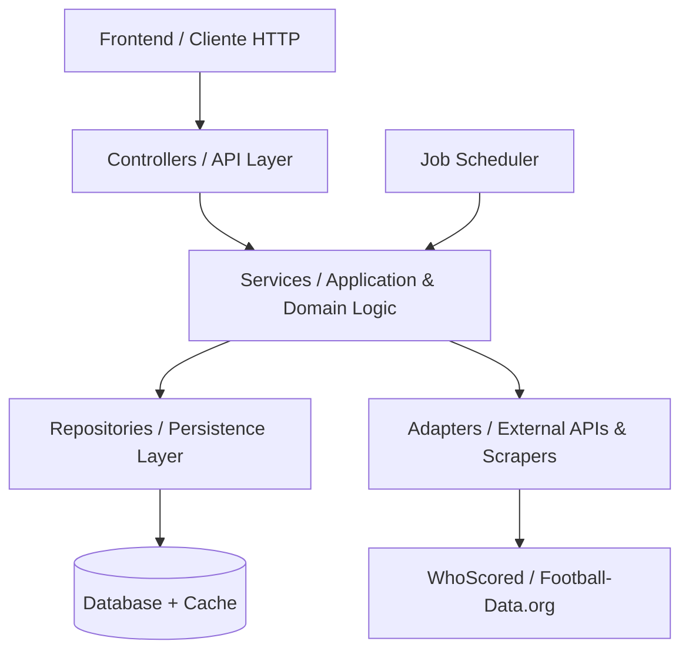

# Contexto del Proyecto: Valoración de Mercado de Jugadores de Fútbol (Marketplace de Tokens)

> **Propósito del Documento:**
> Este documento constituye la **fuente de verdad permanente y canónica** del proyecto para el desarrollo guiado por especificaciones (Spec-Driven Development / SDD). Ha sido elaborado a partir del análisis exhaustivo del documento de visión del trabajo práctico (`Consigna tp.pdf`). Cualquier agente o desarrollador que trabaje en futuras sesiones debe utilizar este contexto sin requerir la relectura o reprocesamiento del PDF original.

---

## 1. Visión General y Objetivo

El proyecto consiste en el desarrollo de un sistema integral compuesto por:
1. Un **Backend** con una suite de **APIs REST** que integra datos de rendimiento de jugadores de fútbol de las 5 principales ligas europeas, calcula periódicamente su cotización de mercado mediante estrategias de valuación configurables, y gestiona un mercado transaccional de compra y venta de tokens de jugadores.
2. Un **Frontend Web responsivo** que consume dicha API y permite a los usuarios consultar catálogos, rankings, evolución histórica de cotizaciones, operar en el mercado financiero de tokens y gestionar su portfolio de inversiones con métricas de rentabilidad.

### Ligas Cubiertas (Obligatorias)
El sistema debe incorporar información y jugadores de 5 ligas oficiales:
1. **Premier League** (Inglaterra)
2. **Bundesliga** (Alemania)
3. **La Liga** (España)
4. **Serie A** (Italia)
5. **Ligue 1** (Francia)

---

## 2. Dominio del Problema y Modelo Conceptual

### 2.1 Conceptos Fundamentales

- **Jugador (Player):** Entidad representativa de un futbolista real perteneciente a una de las 5 ligas soportadas. Posee datos biográficos/deportivos (nombre, equipo, liga, posición) y un conjunto de métricas de rendimiento extraídas de fuentes externas.
- **Cotización (Quote / Valuation):** Valor monetario/crediticio asignado a un jugador en un momento determinado en el tiempo. Varía periódicamente en función de la estrategia de valuación activa y el rendimiento deportivo del jugador.
- **Token de Jugador:** Unidad fraccional de inversión asociada a un jugador.
  - **Emisión fija:** Cada jugador cuenta con exactamente **100 tokens emitidos**.
  - **Superusuario:** Existe un único superusuario que es el **dueño inicial de todos los tokens** de todos los jugadores.
  - **Momento Cero ($t_0$):** En el momento inicial, cada token tiene un valor base fijado en **1 crédito**.
- **Usuario Inversor:** Usuario registrado en el sistema con capacidad para operar en el mercado comprando y vendiendo tokens utilizando créditos.
- **Transacción / Orden de Mercado (Order):** Registro de intercambio económico:
  - **Compra (`BUY`):** Un usuario adquiere tokens de un jugador a la cotización vigente. En la etapa inicial, la compra se ejecuta contra la tenencia del superusuario. Se valida disponibilidad de tokens y saldo del usuario.
  - **Venta (`SELL`):** Un usuario liquida tokens en su posesión a la cotización vigente. Se valida que el usuario posea la cantidad solicitada.
- **Posición / Portfolio:** Estado consolidado de las tenencias de un usuario, indicando:
  - Cantidad de tokens por jugador.
  - Precio promedio ponderado de compra.
  - Valorización actual de la tenencia (Tokens $\times$ Cotización actual).
  - Ganancia o pérdida (Profit & Loss / PnL), tanto absoluta como porcentual.
  - Historial de operaciones realizadas.

---

## 3. Sistema de Cotización y Estrategias de Valuación

### 3.1 Mecánica de Cotización
- **Cálculo periódico:** Las cotizaciones deben recalcularse de forma automática y programada (por ejemplo, con frecuencia semanal).
- **Ejecución manual / bajo demanda:** Debe existir un endpoint administrativo para forzar el recálculo inmediato de cotizaciones.
- **Historial inmutable:** Cada recálculo genera una nueva entrada histórica en la serie temporal de cotizaciones del jugador, registrando la fecha/hora, el valor obtenido y la versión/estrategia utilizada.
- **Consultas temporales:** El sistema debe permitir consultar la cotización actual y la cotización histórica para cualquier fecha dada.

### 3.2 Estrategias de Valuación (Mínimo 2 requeridas)
El sistema debe soportar **al menos 2 estrategias configurables** de ponderación del valor de los jugadores basadas en distintos criterios de performance y contexto deportivo.

#### Características de una Estrategia:
1. **Métricas consideradas:**
   - Minutos jugados, goles, asistencias, tiros al arco, pases realizados, pases clave (*key passes*), regates (*dribbles*), recuperaciones / entradas (*tackles*), intercepciones, faltas cometidas, tarjetas amarillas y rojas, rating general del partido/temporada, posición en cancha.
2. **Impacto diferenciado:**
   - *Impacto positivo:* Goles, asistencias, tiros, pases clave, rating alto, minutos jugados completos.
   - *Impacto negativo:* Jugar menos de 90 minutos, cometer faltas reiteradas, recibir tarjetas amarillas o rojas.
3. **Ponderación configurable por métrica y posición:**
   - Cada métrica cuenta con un peso configurable dentro de la estrategia.
   - Se permite diferenciar pesos según la posición (ej. delanteros priorizan goles/tiros; defensores priorizan quites/intercepciones).
4. **Fórmula de derivación:**
   - Cálculo de un `Score` de performance (ej. métricas normalizadas en rango $[0, 1]$ multiplicadas por sus ponderadores).
   - Conversión de Score a Precio:
     $$\text{Valor} = \text{ValorBase} + (\text{Score} \times \text{FactorEscala})$$
5. **Trazabilidad y versionado:**
   - Cada estrategia debe ser identificable y configurable.
   - Cada registro histórico de cotización debe guardar qué estrategia y qué versión se utilizó para calcularla.

---

## 4. Requisitos Funcionales (Endpoints API REST)

El backend debe exponer de forma obligatoria los siguientes endpoints organizados por contexto de negocio:

| Método | Endpoint | Contexto | Descripción |
| :--- | :--- | :--- | :--- |
| `GET` | `/players` | Catálogo | Listado de jugadores con soporte de filtros por **liga**, **equipo** y **posición**. |
| `GET` | `/players/:id` | Catálogo | Detalle completo de un jugador específico y sus estadísticas. |
| `GET` | `/players/:id/quotes` | Cotización | Historial completo de cotizaciones temporales de un jugador. |
| `GET` | `/players/ranking` | Cotización | Ranking ordenado de jugadores según la estrategia de valuación activa. |
| `POST` | `/quotes/recalculate` | Cotización | Disparo manual/administrativo del proceso de recálculo de cotizaciones. |
| `POST` | `/orders/buy` | Mercado | Ejecutar una orden de compra de tokens de un jugador validando disponibilidad y cotización vigente. |
| `POST` | `/orders/sell` | Mercado | Ejecutar una orden de venta de tokens de un jugador validando tenencia previa. |
| `GET` | `/users/:id/portfolio` | Mercado | Consulta del portfolio valorizado de un usuario (tokens, precio promedio, valor actual, PnL). |
| `GET` | `/users/:id/transactions` | Mercado | Historial cronológico de transacciones financieras y órdenes del usuario. |

*Nota adicional del enunciado:* El sistema debe permitir el registro y creación de nuevos usuarios para operar en el mercado.

---

## 5. Integración con Fuentes Externas y Resiliencia

### 5.1 Fuentes de Datos Definidas
1. **WhoScored (Web Scraping):**
   - Extracción de datos detallados de rendimiento a nivel de partido y jugador (pases, tiros, intercepciones, quites, faltas, tarjetas, minutos y calificaciones/ratings).
   - Ejemplos de referencia del TP: páginas de estadísticas de partidos de jugadores como Ludovic Ajorque, Kylian Mbappé, Harry Kane.
2. **Football-Data.org (API REST Oficial):**
   - Obtención de fixtures, resultados de partidos, tablas y alineaciones oficiales de las 5 ligas.

### 5.2 Requisito de Integración y Tolerancia a Fallos
- El sistema debe consumir **al menos una API externa** de datos de fútbol.
- **Tolerancia a caídas:** El sistema debe implementar mecanismos de fallback y tolerancia a fallos del proveedor externo (vía caché o datos persistidos localmente), garantizando que las consultas y operaciones sigan funcionando aun si la fuente externa no se encuentra disponible.

---

## 6. Requisitos No Funcionales (RNF)

### 6.1 Observabilidad
- **Structured Logging:** Registro de logs en formato estructurado (ej. JSON) con niveles de severidad adecuados para facilitar la indexación y el análisis.
- **Correlation IDs:** Propagación de identificadores de correlación en todas las solicitudes HTTP y flujos asíncronos para garantizar la trazabilidad extremo a extremo.
- **Health Checks & Métricas:** Exposición de endpoints de salud (liveness/readiness) y métricas operativas clave (latencia de respuesta, tasa de errores $4xx/5xx$, throughput).

### 6.2 Auditoría
- **Inmutabilidad:** Registro append-only inmutable de todas las transacciones financieras y cambios patrimoniales.
- **Datos obligatorios por evento auditado:**
  1. Identificación del autor de la acción (ID de usuario / superusuario / sistema).
  2. Detalle de cambios realizados y marca temporal precisa (timestamp ISO-8601).
  3. Estado anterior y estado posterior de la entidad modificada (snapshots de saldo/tokens).

### 6.3 Rendimiento y Optimización
- **SLAs claros:** Definición y cumplimiento de objetivos de tiempo de respuesta para endpoints de lectura y transaccionales.
- **Indexación:** Optimización de esquemas de bases de datos mediante índices estratégicos (ej. sobre `player_id`, `user_id`, `created_at`, claves foráneas y campos de filtro frecuente como `league`, `team`, `position`).
- **Capa de Caché Obligatoria:** Implementación de caché (ej. Redis o in-memory) para optimizar consultas de lectura de alta demanda y mitigar la latencia/rate-limits de proveedores externos.

### 6.4 Componentes Técnicos Requeridos
- **Job Scheduler:** Sistema de tareas programadas en segundo plano para la ejecución de procesos batch (recálculo semanal de cotizaciones, ingesta/actualización periódica de datos de jugadores).
- **Capa de Caché:** Capa intermedia para datos calientes y estrategia de degradación elegante (*stale-while-revalidate* o *cache-aside*).

### 6.5 Seguridad
- **Validación Estricta de Entradas (Input Validation):** Sanitización y tipado de payloads entrantes para prevenir inyecciones y datos corruptos.
- **Gestión Segura de Autenticación y Autorización:** Manejo seguro de credenciales y tokens de sesión/acceso para proteger operaciones de usuario y endpoints administrativos.

### 6.6 Documentación Técnica
- **OpenAPI (Swagger):** Especificación formal y documentación interactiva obligatoria de todos los endpoints de la API REST.

---

## 7. Requisitos de Frontend (UI/UX)

El sistema debe incluir una aplicación web responsiva construida para interactuar con la API REST del backend:

### Capacidades Requeridas en la Interfaz:
1. **Catálogo de Jugadores:**
   - Exploración visual y tabular del universo de jugadores.
   - Filtros dinámicos por liga (5 ligas), equipo y posición deportiva.
2. **Ficha y Detalle de Jugador:**
   - Métricas y estadísticas individuales.
   - Gráfico de evolución temporal de cotizaciones históricas.
3. **Ranking de Jugadores:**
   - Tabla comparativa de jugadores clasificados según el score y cotización de la estrategia activa.
4. **Módulo de Mercado (Trading):**
   - Flujo de compra y venta de tokens en tiempo real con validación de disponibilidad y cotización vigente.
   - Autenticación de usuario para operar.
5. **Portfolio Personal:**
   - Visualización de posiciones activas (jugadores, cantidad de tokens, precio medio de compra, valuación actual).
   - Métricas de ganancia/pérdida (PnL total y por activo).
   - Historial detallado de órdenes y transacciones pasadas.

---

## 8. Arquitectura Esperada

El backend debe estructurarse estrictamente siguiendo una arquitectura en capas limpias y desacopladas:

- **Controllers:** Manejo de solicitudes HTTP, enrutamiento, deserialización, validación inicial de parámetros y códigos de respuesta.
- **Services:** Reglas de negocio puras, orquestación de operaciones transaccionales, cálculo de estrategias de valuación, gestión de portfolios y auditoría.
- **Repositories:** Abstracción de acceso a datos persistentes y cachés locales.
- **Adapters:** Clientes para APIs externas y módulos de web scraping con manejo de errores y resiliencia.

---

## 9. Escenarios de Prueba y Demostración Obligatorios

Durante las instancias de evaluación se deberá poder demostrar fehacientemente como mínimo los siguientes tres escenarios:

1. **Escenario 1 (Ingesta y Catálogo):** Construcción completa de la base de datos de jugadores a partir de las fuentes externas definidas (WhoScored / Football-Data.org).
2. **Escenario 2 (Evolución de Cotizaciones):** Obtención y visualización de la cotización de un jugador representativo de cada una de las 5 ligas en distintas fechas, demostrando la variación de su valor a lo largo del tiempo.
3. **Escenario 3 (Ciclo Transaccional Completo):** 
   - Creación y registro de **4 usuarios**.
   - Compra de tokens de **5 jugadores distintos** al inicio del campeonato (momento $t_0$).
   - Simulación del paso del tiempo y recálculo de cotizaciones.
   - Demostración de la valorización actual y el balance de ganancias/pérdidas de las posiciones de los 4 usuarios a la fecha final.

---

## 10. Trazabilidad: Requisitos Explícitos vs Inferencias de Dominio

Para preservar la máxima fidelidad conceptual, a continuación se discriminan los aspectos expresamente definidos de aquellos derivados por coherencia del modelo:

| Concepto | Establecido Explícitamente en el TP | Inferencia Necesaria de Dominio |
| :--- | :--- | :--- |
| **Ligas** | Exactamente 5: Premier League, Bundesliga, La Liga, Serie A, Ligue 1. | Mapeo de IDs de equipos/ligas homogéneo entre WhoScored y Football-Data.org. |
| **Emisión de Tokens** | 100 tokens por jugador, emitidos inicialmente al Superusuario. | Los tokens son indivisibles (enteros) a menos que se defina soporte decimal. |
| **Precio Inicial** | 1 crédito por token en $t_0$. | El balance inicial de créditos de los nuevos usuarios debe ser configurable o asignado en el registro. |
| **Operación de Compra** | Compras iniciales contra el Superusuario a precio vigente. | Cuando un usuario vende tokens, estos retornan a la tenencia del Superusuario (o pool central) para mantener el circulante constante en 100. |
| **Auditoría** | Registro inmutable con autor, cambios, timestamp, estado previo y posterior. | Implementación mediante tabla/colección append-only dedicada a eventos de auditoría financiera. |
| **Estrategias** | Mínimo 2 estrategias configurables con pesos y versionado histórico. | Patrón Strategy en capa de dominio con persistencia de metadatos de la fórmula utilizada. |
| **Caché & Scheduler** | Requeridos explícitamente para desacoplar APIs externas y recálculos periódicos. | Mecanismo de reintento/circuit breaker en caso de fallos repetidos del scraper o API externa. |

---

## 11. Ambigüedades y Decisiones Técnicas Pendientes

Las siguientes cuestiones no están fijadas de manera unívoca en el enunciado y deben ser decididas explícitamente por el equipo de desarrollo o validadas con los docentes:

1. **Gestión del Saldo de Créditos del Usuario:**
   - *Punto abierto:* ¿Con cuántos créditos iniciales se crea un usuario nuevo? ¿Se requiere un endpoint para fondear/recargar créditos (`POST /users/:id/deposit`) o se otorga un saldo fijo de bienvenida?
2. **Destino de los Tokens Vendidos:**
   - *Punto abierto:* Al ejecutar `POST /orders/sell`, ¿los créditos provienen del superusuario/banco del sistema y los tokens regresan al inventario del superusuario, o existe un libro de órdenes P2P entre usuarios? (El TP sugiere fuertemente un modelo contra el creador de mercado / superusuario).
3. **Mecanismo de Scraping vs API Externa en Entornos de CI/CD o Evaluación:**
   - *Punto abierto:* Dado que WhoScored suele aplicar protecciones antibot (Cloudflare, etc.), ¿se implementará un scraper resiliente con fallback a datasets locales precargados (seeds/mocks) para asegurar la reproducibilidad de las pruebas de evaluación?
4. **Estrategia y Motor de Autenticación:**
   - *Punto abierto:* El TP solicita manejo seguro de tokens y autenticación en frontend, pero no especifica la tecnología (JWT stateless, OAuth2, Session cookies) ni define el endpoint exacto (ej. `POST /auth/login` o `POST /users/register`).
5. **Tecnología de Persistencia y Base de Datos:**
   - *Punto abierto:* El enunciado no impone un motor específico (PostgreSQL, MySQL, MongoDB, etc.), requiriendo únicamente diseño en capas con repositorios e indexación estratégica.
6. **Contrato Detallado de DTOs en Órdenes:**
   - *Punto abierto:* Estructura exacta del payload en `/orders/buy` y `/orders/sell` (ej. `{ "userId": string, "playerId": string, "quantity": number }`).

---
*Fin del documento de contexto del proyecto.*
