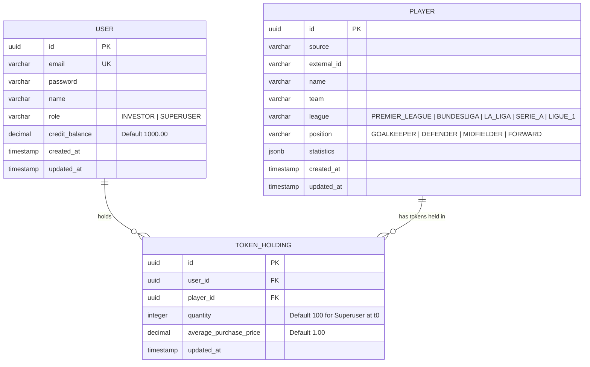

# Data Model Specification: Entrega 1 - Core CI/CD, Modelo Mínimo, Autenticación y Catálogo

**Feature**: [spec.md](./spec.md)  
**Date**: 2026-09-12  
**Status**: Ready  

---

## 1. Conceptual ER Diagram (Entrega 1 Scope)



---

## 2. Table Schemas & Drizzle ORM Definitions

### 2.1 Table `users`

Represents system actors (Investors and the central Superuser / Market Creator).

| Column | Type | Constraints | Default | Description |
| :--- | :--- | :--- | :--- | :--- |
| `id` | `uuid` | `PRIMARY KEY`, not null | `gen_random_uuid()` | Unique identifier for the user. |
| `email` | `varchar(255)` | `UNIQUE`, not null | - | Unique login email. |
| `password` | `varchar(255)` | not null | - | Password stored directly for the academic scope. |
| `name` | `varchar(150)` | not null | - | Full name or display name. |
| `role` | `varchar(20)` | not null | `'INVESTOR'` | Role enum: `INVESTOR`, `SUPERUSER`. |
| `credit_balance` | `numeric(12, 2)`| not null | `1000.00` | Account balance. Investors start with 1,000.00. |
| `created_at` | `timestamp with time zone` | not null | `now()` | Registration timestamp. |
| `updated_at` | `timestamp with time zone` | not null | `now()` | Last profile update timestamp. |

**Indexes**:
- `idx_users_email` ON `users (email)` (Unique)

---

### 2.2 Table `players`

Represents footballers from the 5 European leagues.

| Column | Type | Constraints | Default | Description |
| :--- | :--- | :--- | :--- | :--- |
| `id` | `uuid` | `PRIMARY KEY`, not null | `gen_random_uuid()` | Unique identifier for the player. |
| `source` | `varchar(50)` | not null | - | External source identifier, e.g. `WHOSCORED`. |
| `external_id` | `varchar(100)` | not null | - | Player identifier supplied by the external source. |
| `name` | `varchar(150)` | not null | - | Player full name. |
| `team` | `varchar(100)` | not null | - | Official club team name. |
| `league` | `varchar(50)` | not null | - | League enum: `PREMIER_LEAGUE`, `BUNDESLIGA`, `LA_LIGA`, `SERIE_A`, `LIGUE_1`. |
| `position` | `varchar(30)` | not null | - | Position enum: `GOALKEEPER`, `DEFENDER`, `MIDFIELDER`, `FORWARD`. |
| `statistics` | `jsonb` | not null | `'{}'::jsonb` | Minimal metrics: appearances, minutesPlayed, rating, goals, assists, shotsPerGame, tacklesPerGame, interceptionsPerGame, foulsPerGame, yellowCards and redCards. |
| `created_at` | `timestamp with time zone` | not null | `now()` | Ingestion timestamp. |
| `updated_at` | `timestamp with time zone` | not null | `now()` | Last statistics update timestamp. |

**Indexes**:
- `uq_players_source_external_id` ON `players (source, external_id)` (Unique for idempotent source synchronization)
- `idx_players_league_team_pos` ON `players (league, team, position)` (Composite for catalog filters)
- `idx_players_team` ON `players (team)`
- `idx_players_league` ON `players (league)`

---

### 2.3 Table `token_holdings`

Tracks token ownership per user per player (maintains the 100 fixed tokens conservation invariant).

| Column | Type | Constraints | Default | Description |
| :--- | :--- | :--- | :--- | :--- |
| `id` | `uuid` | `PRIMARY KEY`, not null | `gen_random_uuid()` | Unique record ID. |
| `user_id` | `uuid` | `FOREIGN KEY (users.id)`, not null | - | Owner user ID. |
| `player_id` | `uuid` | `FOREIGN KEY (players.id)`, not null | - | Player token ID. |
| `quantity` | `integer` | not null | `0` | Number of tokens held (positive integer). |
| `average_purchase_price` | `numeric(10, 2)` | not null | `1.00` | Weighted average acquisition price. |
| `updated_at` | `timestamp with time zone` | not null | `now()` | Last change timestamp. |

**Indexes & Constraints**:
- `uq_user_player_holding` UNIQUE ON `token_holdings (user_id, player_id)`
- `chk_positive_quantity` CHECK `(quantity >= 0)`

---

### 2.4 Table `quote_history` (Deferred)

This table is intentionally deferred. It belongs to the delivery that introduces token quotations and valuation strategies; it is not part of the minimal Feature C schema.

Temporal snapshots of player valuations.

| Column | Type | Constraints | Default | Description |
| :--- | :--- | :--- | :--- | :--- |
| `id` | `uuid` | `PRIMARY KEY`, not null | `gen_random_uuid()` | Unique quote ID. |
| `player_id` | `uuid` | `FOREIGN KEY (players.id)`, not null | - | Target player ID. |
| `value` | `numeric(10, 2)` | not null | `1.00` | Quoted price per token in credits. |
| `strategy_name` | `varchar(100)` | not null | `'INITIAL_BASE_STRATEGY'` | Name of active valuation strategy. |
| `strategy_version` | `varchar(20)` | not null | `'v1.0.0'` | Version of the calculation algorithm. |
| `calculated_at` | `timestamp with time zone` | not null | `now()` | Snapshot creation timestamp. |

**Indexes**:
- `idx_quote_player_calculated_at` ON `quote_history (player_id, calculated_at DESC)`

---

### 2.5 Table `audit_logs` (Deferred)

This table is intentionally deferred until there are financial operations and state transitions that require an audit trail.

Immutable audit log for financial and critical actions.

| Column | Type | Constraints | Default | Description |
| :--- | :--- | :--- | :--- | :--- |
| `id` | `uuid` | `PRIMARY KEY`, not null | `gen_random_uuid()` | Audit event ID. |
| `user_id` | `uuid` | `FOREIGN KEY (users.id)`, nullable | - | Author ID if user-triggered. |
| `action` | `varchar(100)` | not null | - | E.g. `USER_REGISTERED`, `PLAYER_IMPORTED`. |
| `previous_state` | `jsonb` | nullable | - | Snapshot before change. |
| `new_state` | `jsonb` | nullable | - | Snapshot after change. |
| `correlation_id` | `varchar(100)` | nullable | - | Correlation ID from request. |
| `created_at` | `timestamp with time zone` | not null | `now()` | Immutable timestamp. |

---

## 3. Domain Entity Enums & Invariants

### 3.1 `League`
```typescript
export enum League {
  PREMIER_LEAGUE = "PREMIER_LEAGUE",
  BUNDESLIGA = "BUNDESLIGA",
  LA_LIGA = "LA_LIGA",
  SERIE_A = "SERIE_A",
  LIGUE_1 = "LIGUE_1",
}
```

### 3.2 `Position`
```typescript
export enum Position {
  GOALKEEPER = "GOALKEEPER",
  DEFENDER = "DEFENDER",
  MIDFIELDER = "MIDFIELDER",
  FORWARD = "FORWARD",
}
```

### 3.3 `UserRole`
```typescript
export enum UserRole {
  INVESTOR = "INVESTOR",
  SUPERUSER = "SUPERUSER",
}
```
