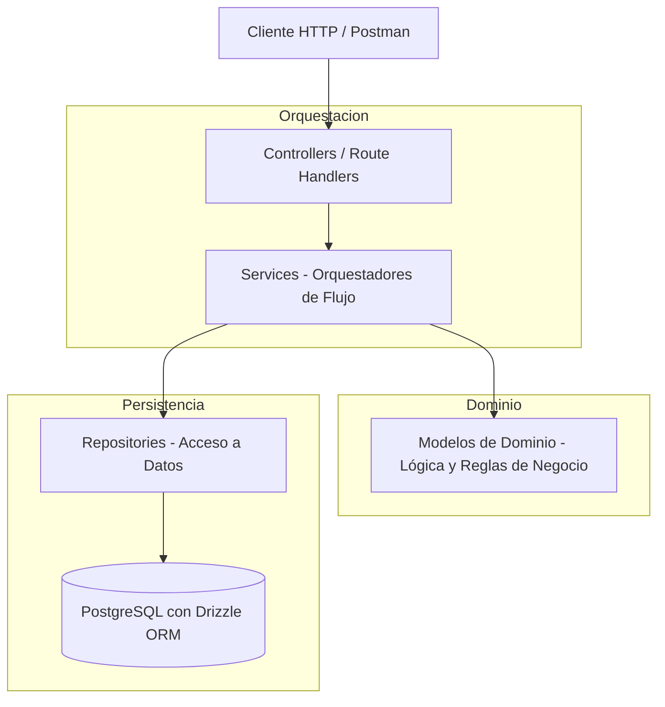

# Implementation Plan: Entrega 1 - Core CI/CD, Modelo Mínimo, Autenticación y Catálogo de Jugadores

**Feature Branch**: `feature/001-player-token-marketplace`  
**Base Integration Branch**: `dev`  
**Specification**: [spec.md](./spec.md)  
**Research**: [research.md](./research.md)  
**Data Model**: [data-model.md](./data-model.md)  
**API Contracts**: [contracts/openapi.yaml](./contracts/openapi.yaml)  
**Postman Collection**: [contracts/postman_collection.json](./contracts/postman_collection.json)  
**Quickstart**: [quickstart.md](./quickstart.md)  
**Status**: Ready for Implementation  

---

## 1. Protocolo GitFlow y Flujo de Trabajo

Para el desarrollo del proyecto se adopta estrictamente el siguiente flujo de trabajo GitFlow:

1. **Rama de Integración**: `dev` es la rama base de integración continua.
2. **Creación de Ramas por Feature**: Cada feature se desarrolla en su propia rama creada a partir de `dev`.
   - Convención de nombres: `feature/<identificador>-<nombre-corto>` (Ejemplo: `feature/001-player-token-marketplace`).
3. **Prohibición de Trabajo Directo**: Queda terminantemente prohibido desarrollar o commitear directamente sobre `dev` o `main`.
4. **Commits Granulares**: Los commits deben ser pequeños, atómicos, coherentes y con mensajes/títulos claros y descriptivos.
5. **Apertura y Publicación de Pull Requests (PRs)**:
   - El agente tiene autorización y la responsabilidad de crear ramas de trabajo, realizar commits, hacer push al repositorio remoto y abrir/publicar Pull Requests directamente hacia `dev`.
   - El PR debe incluir un título convencional y una descripción clara y concisa que detalle qué se implementó y qué requisitos de la especificación/plan satisface.
6. **Aprobación y Merge Exclusivos de Project Owners**:
   - **El agente NO puede aprobar ni mergear Pull Requests**. La revisión, aprobación y el merge corresponden de forma exclusiva a los Project Owners.
7. **Pipeline Automatizado en GitHub Actions (Sin Polling Activo)**:
   - Toda apertura o actualización de PR dispara de forma automática el pipeline en GitHub Actions (`.github/workflows/ci.yml`), el cual compila, ejecuta linter, corre tests con cobertura y evalúa el Quality Gate en SonarCloud.
   - El agente **no** debe realizar seguimiento activo ni bloquearse haciendo polling del pipeline; cualquier fallo reportado por el CI/CD será informado para su oportuna resolución.
8. **Resolución de Conflictos o Decisiones Funcionales**:
   - Ante cualquier conflicto de integración o decisión que pueda alterar el comportamiento funcional del sistema, se debe consultar a los Project Owners antes de proceder.

---

## 2. Resumen Ejecutivo y Alcance

Este plan de implementación cubre la entrega de la **Entrega 1** del Trabajo Práctico de Mercado de Tokens de Jugadores. Aplica la arquitectura en capas estándar **Controller $\to$ Service $\to$ Repository** con un **Modelo de Dominio Rico** (*Rich Domain Model*), asegurando que:
- **La lógica y reglas de dominio residen en las entidades del Modelo** (invariantes, validación de ligas, saldo inicial, reglas de negocio).
- **Los Servicios actúan como Orquestadores de flujo** (coordinan repositorios, invocan el comportamiento del modelo y coordinan servicios de infraestructura como JWT o hash).
- **Los Repositorios encapsulan el acceso a datos** (Drizzle ORM sobre PostgreSQL).
- **Los Controladores manejan la interfaz HTTP** (validación de payloads de entrada con Zod y respuestas REST).

---

## 3. Responsabilidades Arquitectónicas Claras



| Capa | Componentes | Responsabilidad Específica |
| :--- | :--- | :--- |
| **Modelo de Dominio** | `User`, `Player`, `TokenHolding`, `Quote` (`src/models/` o `src/domain/`) | **Lógica de negocio pura e invariantes:** Validación estricta de las 5 ligas oficiales, asignación de 1.000 créditos de bienvenida al inversor, verificación de saldo, emisión fija de 100 tokens a cotización base de 1 crédito en $t_0$. |
| **Servicios (Orquestadores)** | `AuthService`, `PlayerService` (`src/services/`) | **Orquestación de flujos de aplicación:** Coordina la búsqueda en repositorios, invoca métodos de negocio de los modelos, coordina el hasheo de contraseñas y emisión de JWT, y persiste los cambios. |
| **Repositorios** | `UserRepository`, `PlayerRepository` (`src/repositories/`) | **Persistencia y consultas:** Mapea entidades de dominio a tablas relacionales de PostgreSQL vía Drizzle ORM. |
| **Controladores / API** | `auth.controller.ts`, `player.controller.ts`, Next.js Route Handlers | **Adaptador HTTP:** Valida la estructura de las peticiones (Zod), extrae parámetros, invoca al servicio orquestador y devuelve el código HTTP correspondiente (200, 201, 400, 401, 404, 409). |
| **Middlewares** | `auth.middleware.ts` | **Seguridad y Control de Acceso:** Verifica el token Bearer JWT (24h) y protege rutas privadas retornando `401 Unauthorized`. |

---

## 4. Estructura de Directorios

```
desapp-grupo-c/
├── .github/
│   └── workflows/
│       └── ci.yml                   # Pipeline CI (Lint, Build, Vitest Coverage, SonarCloud)
├── docs/                            # Documentación y contexto del TP
├── specs/
│   └── 001-player-token-marketplace/
│       ├── spec.md                  # Especificación de la feature
│       ├── plan.md                  # Este plan de implementación
│       ├── research.md              # Decisiones técnicas y arquitectura
│       ├── data-model.md            # Esquemas de base de datos y modelos
│       ├── quickstart.md            # Guía rápida de ejecución y pruebas
│       └── contracts/
│           ├── openapi.yaml         # Contrato OpenAPI 3.0
│           └── postman_collection.json # Colección de Postman para verificación manual
├── src/
│   ├── app/                         # Enrutamiento HTTP Next.js (App Router)
│   │   ├── api/
│   │   │   ├── auth/
│   │   │   │   ├── register/
│   │   │   │   │   └── route.ts     # Endpoint POST /api/auth/register
│   │   │   │   └── login/
│   │   │   │       └── route.ts     # Endpoint POST /api/auth/login
│   │   │   ├── players/
│   │   │   │   ├── route.ts         # Endpoint GET /api/players (Filtros + Paginación)
│   │   │   │   └── [id]/
│   │   │   │       └── route.ts     # Endpoint GET /api/players/:id
│   │   │   ├── health/
│   │   │   │   └── route.ts         # Endpoint GET /api/health
│   │   │   └── docs/
│   │   │       └── route.ts         # Endpoint Swagger OpenAPI UI
│   │   ├── layout.tsx
│   │   └── page.tsx
├── controllers/                 # Controladores HTTP (manejan Request/Response y validación de schema)
│   ├── auth.controller.ts
│   ├── player.controller.ts
│   └── health.controller.ts
├── services/                    # Servicios Orquestadores de Flujo
│   ├── auth.service.ts          # Orquesta: verificar unicidad -> crear entidad User -> persistir -> JWT
│   └── player.service.ts        # Orquesta: consultar repositorio con filtros y paginación -> mapear
├── models/                      # MODELO DE DOMINIO RICO (Entidades con comportamiento e invariantes)
│   ├── enums.ts                 # League (5 ligas oficiales), Position, UserRole
│   ├── User.ts                  # Entidad User: validación de email, asignación 1.000 créditos, roles
│   ├── Player.ts                # Entidad Player: invariante de 5 ligas, métricas, validaciones
│   ├── TokenHolding.ts          # Tenencia de tokens: invariante de emisión de 100 tokens en t0
│   └── errors.ts                # Errores de dominio (InvalidLeagueError, DomainValidationError, etc.)
├── repositories/                # Repositorios Drizzle ORM
│   ├── user.repository.ts       # findByEmail, findById, save
│   └── player.repository.ts     # findMany(filters, pagination), findById
├── db/                          # Configuración y esquemas Drizzle ORM
│   ├── schema.ts                # Tablas PostgreSQL: users, players, token_holdings, quote_history, audit_logs
│   ├── index.ts                 # Conexión PostgreSQL
│   └── seeds/
│       └── seed.ts              # Dataset inicial de 15 jugadores (3 por liga) + superusuario
├── middlewares/                 # Middlewares y utilidades transversales
│   ├── auth.middleware.ts       # Interceptor Bearer JWT (24h) con rechazo 401
│   └── logger.ts                # Structured Logger con Correlation IDs
├── utils/                       # Utilidades de infraestructura
│   ├── jwt.ts                   # Generación y validación de tokens JWT
│   └── hash.ts                  # Hasheo seguro con bcrypt
├── tests/                           # Suite de Testing con Vitest
│   ├── unit/
│   │   ├── models/                  # Tests unitarios del Modelo de Dominio (lógica pura e invariantes)
│   │   │   ├── User.spec.ts
│   │   │   └── Player.spec.ts
│   │   └── services/                # Tests unitarios de los Servicios Orquestadores (con mocks de repositorios)
│   │       ├── auth.service.spec.ts
│   │       └── player.service.spec.ts
│   └── integration/                 # Tests de integración de endpoints HTTP
│       ├── auth.routes.spec.ts
│       ├── players.routes.spec.ts
│       └── health.routes.spec.ts
├── drizzle.config.ts                # Configuración de Drizzle Kit
├── sonar-project.properties         # Configuración de SonarCloud
├── vitest.config.ts                 # Configuración de Vitest
└── package.json
```

---

## 5. Fases de Implementación y Commits Granulares

Cada fase se implementa mediante commits pequeños, atómicos y bien documentados en la rama `feature/001-player-token-marketplace`:

### Fase 1: Setup de Tooling, Dependencias y Configuración
- Instalar dependencias de runtime y desarrollo (`drizzle-orm`, `postgres`, `bcryptjs`, `jsonwebtoken`, `zod`, `vitest`, `@vitest/coverage-v8`, `swagger-ui-dist`).
- Configurar `vitest.config.ts` (ESM, path aliases, reporte de cobertura) y `sonar-project.properties`.
- *Commit*: `chore: configure vitest, drizzle and sonarcloud tooling`

### Fase 2: Modelo de Dominio Rico y Tests Unitarios (TDD)
- **Implementar `src/models/enums.ts`**: `League` (Premier League, Bundesliga, La Liga, Serie A, Ligue 1), `Position`, `UserRole`.
- **Implementar entidad `User`**: Reglas de negocio e invariantes (email válido, 1.000 créditos iniciales para inversor).
- **Implementar entidad `Player`**: Reglas de negocio e invariantes (validación estricta de las 5 ligas oficiales, métricas).
- **Implementar entidad `TokenHolding`**: Invariante de 100 tokens emitidos en $t_0$.
- **Escribir tests unitarios en `tests/unit/models/`** validando todas las reglas e invariantes de dominio.
- *Commit*: `feat(domain): implement rich domain models and invariants with unit tests`

### Fase 3: Persistencia con Drizzle ORM y Seeding
- Definir esquemas en `src/db/schema.ts` (`users`, `players`, `token_holdings`, `quote_history`, `audit_logs`).
- Implementar `UserRepository` y `PlayerRepository` mapeando entre tablas de Drizzle y las entidades del modelo.
- Crear script de seed `src/db/seeds/seed.ts` con 15 jugadores (3 por liga para las 5 ligas) y 100 tokens iniciales asignados al superusuario a cotización base de 1 crédito.
- *Commit*: `feat(db): add drizzle schema, repositories and initial dataset seeder`

### Fase 4: Servicios Orquestadores de Aplicación
- Implementar `AuthService` (orquesta validación de unicidad, creación de `User`, hasheo de clave y emisión JWT de 24h).
- Implementar `PlayerService` (orquesta filtros por liga/equipo/posición y paginación con límite default 20).
- Escribir tests unitarios de servicios en `tests/unit/services/` con mocks de repositorios.
- *Commit*: `feat(services): implement auth and player orchestrator services with unit tests`

### Fase 5: Controladores HTTP, Middleware JWT y Swagger Docs
- Implementar `auth.middleware.ts` para verificar `Authorization: Bearer <token>` y rechazar con `401 Unauthorized` si no está autenticado.
- Implementar controladores en `src/controllers/` y conectar con las rutas de Next.js App Router:
  - `POST /api/auth/register`
  - `POST /api/auth/login`
  - `GET /api/players` (protegido)
  - `GET /api/players/[id]` (protegido)
  - `GET /api/health` (público)
  - `/api/docs` (Swagger UI interactivo)
- *Commit*: `feat(api): add auth and players route handlers, auth guard and swagger docs`

### Fase 6: Pipeline CI/CD GitHub Actions y SonarCloud
- Configurar `.github/workflows/ci.yml` ejecutando `lint`, `test:coverage`, `build` y el escaneo de SonarCloud con umbral $<10$ issues y Quality Gate aprobado.
- *Commit*: `ci: add github actions workflow for build, tests coverage and sonarcloud`

### Fase 7: Verificación con Colección de Postman y Creación de PR
- Validar el flujo completo usando la colección [`contracts/postman_collection.json`](./contracts/postman_collection.json).
- Push de la rama `feature/001-player-token-marketplace` al repositorio remoto.
- Creación del **Pull Request hacia `dev`** con descripción detallada de los requisitos satisfechos, dejando la aprobación y merge a los Project Owners.

---

## 6. Matriz de Verificación y Criterios de Aceptación

| Requisito | Componente | Verificación |
| :--- | :--- | :--- |
| **Invariantes de Dominio (5 ligas)** | `src/models/Player.ts` | Test unitario valida rechazo de ligas no oficiales. |
| **Saldo inicial 1.000 créditos** | `src/models/User.ts` | Test unitario valida asignación automática al crear inversor. |
| **Orquestación de Registro & Login** | `src/services/auth.service.ts` | Tests unitarios de servicio con mocks de repositorio. |
| **Token JWT 24h & Protección 401** | `auth.middleware.ts` & `jwt.ts` | Tests de integración verifican 401 sin token y 200 con token válido. |
| **Catálogo con Filtros y Paginación** | `src/services/player.service.ts` | Filtra por liga/equipo/posición con límite por defecto 20. |
| **CI Build SUCCESS & SonarCloud < 10** | `.github/workflows/ci.yml` | Workflow en GitHub Actions pasa al 100%. |
| **Verificación Manual** | `postman_collection.json` | Ejecución completa en Postman de todos los endpoints. |
| **GitFlow & PR a `dev`** | Pull Request hacia `dev` | PR creado desde `feature/001-player-token-marketplace` para revisión de POs. |
