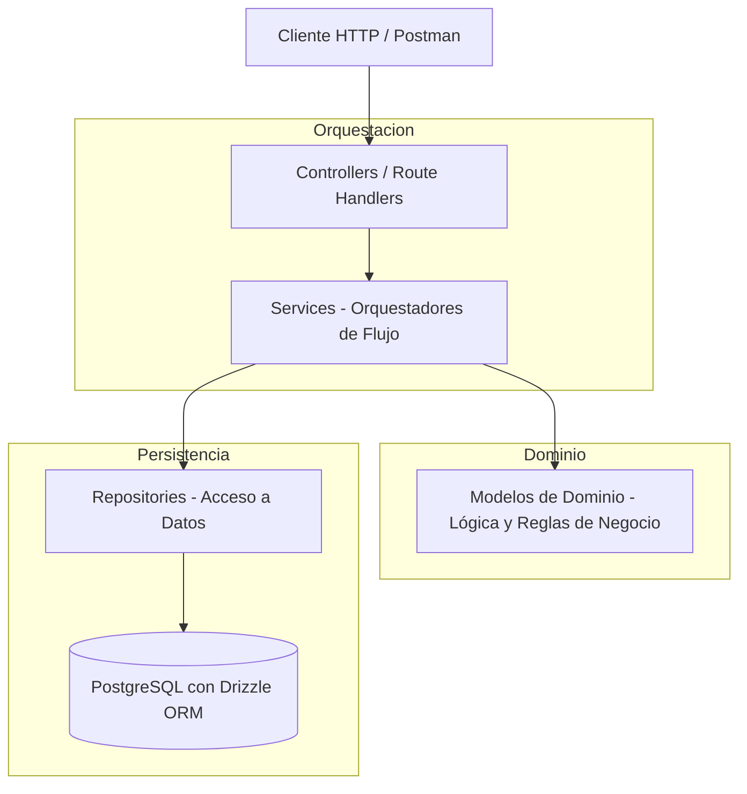

# Implementation Plan: Entrega 1 - Core CI/CD, Modelo Mínimo, Autenticación y Catálogo de Jugadores

**Feature Branch**: `feature/001-player-token-marketplace`  
**Base Integration Branch**: `main`  
**Specification**: [spec.md](./spec.md)  
**Research**: [research.md](./research.md)  
**Data Model**: [data-model.md](./data-model.md)  
**API Contracts**: [contracts/openapi.yaml](./contracts/openapi.yaml)  
**Postman Collection**: [contracts/postman_collection.json](./contracts/postman_collection.json)  
**Execution Guide**: [README.md](../../README.md)
**Status**: Ready for Implementation  

---

## 1. Protocolo GitFlow y Flujo de Trabajo

Para el desarrollo del proyecto se adopta strictly el siguiente flujo de trabajo GitFlow, alineado con la Constitución v1.2.0:

1. **Rama base de integración**: `main` es la única rama base de integración continua del proyecto.
2. **Creación de Ramas por Feature**: Cada feature o incremento productivo se desarrolla en su propia rama creada a partir de `main`.
   - Convención de nombres: `feature/<id>-<nombre-corto-descriptivo>` (Ejemplo: `feature/001-domain-model`, `feature/002-auth-jwt`, `feature/003-player-catalog`).
   - El nombre debe reflejar el contenido concreto de la feature, no el número de fase genérico.
3. **Prohibición de Trabajo Directo**: Queda terminantemente prohibido desarrollar o commitear directamente sobre `main`.
4. **Commits Granulares**: Los commits deben ser pequeños, atómicos, coherentes y con mensajes/títulos claros y descriptivos.
5. **Apertura y Publicación de Pull Requests (PRs)**:
   - El agente tiene autorización y la responsabilidad de crear ramas de trabajo, realizar commits, hacer push al repositorio remoto y abrir/publicar Pull Requests directamente hacia `main`.
   - El PR debe incluir un título convencional y una descripción clara y concisa que detalle qué se implementó y qué requisitos de la especificación/plan satisface.
6. **Aprobación y Merge Exclusivos de Project Owners**:
   - **El agente NO puede aprobar ni mergear Pull Requests**. La revisión, aprobación y el merge corresponden de forma exclusiva a los Project Owners.
7. **Pipeline Automatizado en GitHub Actions (Sin Polling Activo)**:
   - Toda apertura o actualización de PR dispara de forma automática el pipeline en GitHub Actions (`.github/workflows/ci.yml`), el cual compila, ejecuta linter, corre tests con cobertura y evalúa el Quality Gate en SonarCloud.
   - El agente **no** debe realizar seguimiento activo ni bloquearse haciendo polling del pipeline; cualquier fallo reportado por el CI/CD será informado para su oportuna resolución.
8. **Resolución de Conflictos o Decisiones Funcionales**:
   - Ante cualquier conflicto de integración o decisión que pueda alterar el comportamiento funcional del sistema, se debe consultar a los Project Owners antes de proceder.

---

## 2. Resumen Ejecutivo y Alcance

Este plan de implementación cubre la entrega de la **Entrega 1** del Trabajo Práctico de Mercado de Tokens de Jugadores. Aplica la arquitectura en capas estándar **Controller $\to$ Service $\to$ Repository** con un **Modelo de Dominio Rico** (*Rich Domain Model*), asegurando que:
- **La lógica y reglas de dominio residen en las entidades del Modelo** (invariantes, validación de ligas, saldo inicial, reglas de negocio).
- **Los Servicios actúan como Orquestadores de flujo** (coordinan repositorios, invocan el comportamiento del modelo y coordinan servicios de infraestructura como JWT o comparación de contraseñas).
- **Los Repositorios encapsulan el acceso a datos** (Drizzle ORM sobre PostgreSQL).
- **Los Controladores manejan la interfaz HTTP** (validación de payloads de entrada con Zod y respuestas REST).

---

## 3. Responsabilidades Arquitectónicas Claras



| Capa | Componentes | Responsabilidad Específica |
| :--- | :--- | :--- |
| **Modelo de Dominio** | `User`, `Player`, `TokenHolding` (`src/models/`) | **Lógica de negocio pura e invariantes:** Validación estricta de las 5 ligas oficiales y posiciones, asignación de 1.000 créditos de bienvenida al inversor, operaciones de saldo y creación de la tenencia inicial de 100 tokens a cotización base de 1 crédito en $t_0$. |
| **Servicios (Orquestadores)** | `AuthService`, `PlayerService` (`src/services/`) | **Orquestación de flujos de aplicación:** Coordina la búsqueda en repositorios, invoca métodos de negocio de los modelos, coordina el almacenamiento directo de contraseñas y emisión de JWT, y persiste los cambios. |
| **Repositorios** | `UserRepository`, `PlayerRepository` (`src/repositories/`) | **Persistencia y consultas:** Mapea entidades de dominio a tablas relacionales de PostgreSQL vía Drizzle ORM. |
| **Controladores / API** | `auth.controller.ts`, `player.controller.ts`, Next.js Route Handlers | **Adaptador HTTP:** Valida la estructura de las peticiones (Zod), extrae parámetros, invoca al servicio orquestador y devuelve el código HTTP correspondiente (200, 201, 400, 401, 404, 409). |
| **Middlewares** | `auth.middleware.ts` | **Seguridad y Control de Acceso:** Verifica el token Bearer JWT (24h) y protege rutas privadas retornando `401 Unauthorized`. |

---

## 4. Estructura de Directorios

```
desapp-grupo-c/
├── .github/
│   └── workflows/
│       └── ci.yml                   # Pipeline CI (Lint, Build, Vitest Coverage, SonarCloud)
├── docs/                            # Documentación y contexto del TP
├── specs/
│   └── 001-player-token-marketplace/
│       ├── spec.md                  # Especificación de la feature
│       ├── plan.md                  # Este plan de implementación
│       ├── research.md              # Decisiones técnicas y arquitectura
│       ├── data-model.md            # Esquemas de base de datos y modelos
│       ├── README.md                # Guía de ejecución y verificación
│       └── contracts/
│           ├── openapi.yaml         # Contrato OpenAPI 3.0
│           └── postman_collection.json # Colección de Postman para verificación manual
├── src/
│   ├── app/                         # Enrutamiento HTTP Next.js (App Router)
│   │   ├── api/
│   │   │   ├── auth/
│   │   │   │   ├── register/
│   │   │   │   │   └── route.ts     # Endpoint POST /api/auth/register
│   │   │   │   └── login/
│   │   │   │       └── route.ts     # Endpoint POST /api/auth/login
│   │   │   ├── players/
│   │   │   │   ├── route.ts         # Endpoint GET /api/players (Filtros + Paginación)
│   │   │   │   └── [id]/
│   │   │   │       └── route.ts     # Endpoint GET /api/players/:id
│   │   │   ├── health/
│   │   │   │   └── route.ts         # Endpoint GET /api/health
│   │   │   └── docs/
│   │   │       └── route.ts         # Endpoint Swagger OpenAPI UI
│   │   ├── layout.tsx
│   │   └── page.tsx
│   ├── controllers/                 # Controladores HTTP (manejan Request/Response y validación de schema)
│   │   ├── auth.controller.ts
│   │   ├── player.controller.ts
│   │   └── health.controller.ts
│   ├── services/                    # Servicios Orquestadores de Flujo
│   │   ├── auth.service.ts          # Orquesta: verificar unicidad -> crear entidad User -> persistir -> JWT
│   │   └── player.service.ts        # Orquesta: consultar repositorio con filtros y paginación -> mapear
│   ├── models/                      # MODELO DE DOMINIO RICO (Entidades con comportamiento e invariantes)
│   │   ├── enums.ts                 # League (5 ligas oficiales), Position, UserRole
│   │   ├── User.ts                  # Entidad User: invariantes de saldo y roles, asignación 1.000 créditos
│   │   ├── Player.ts                # Entidad Player: invariante de 5 ligas, métricas, validaciones
│   │   ├── TokenHolding.ts          # Tenencia de tokens: invariante de emisión de 100 tokens en t0
│   │   └── errors.ts                # Errores de dominio (InvalidLeagueError, DomainValidationError, etc.)
│   ├── repositories/                # Repositorios Drizzle ORM
│   │   ├── user.repository.ts       # findByEmail, findById, save
│   │   └── player.repository.ts     # findMany(filters, pagination), findById
│   ├── db/                          # Configuración y esquemas Drizzle ORM
│   │   ├── schema.ts                # Tablas PostgreSQL mínimas: users, players, token_holdings
│   │   └── index.ts                 # Conexión PostgreSQL
│   ├── adapters/                    # Integración mínima con fuentes externas
│   │   ├── player-data-source.ts    # Contrato ScrapedPlayer y PlayerDataSource
│   │   └── whoscored.adapter.ts     # Adapter inicial de WhoScored
│   ├── middlewares/                 # Middlewares y utilidades transversales
│   │   └── auth.middleware.ts       # Interceptor Bearer JWT (24h) con rechazo 401
│   └── utils/                       # Utilidades de infraestructura
│       ├── jwt.ts                   # Generación y validación de tokens JWT
│       └── password.ts              # Almacenamiento y verificación de contraseña del alcance académico
├── tests/                           # Suite de Testing con Vitest
│   ├── unit/
│   │   ├── models/                  # Tests unitarios del Modelo de Dominio (lógica pura e invariantes)
│   │   │   ├── User.spec.ts
│   │   │   └── Player.spec.ts
│   │   └── services/                # Tests unitarios de los Servicios Orquestadores (con mocks de repositorios)
│   │       ├── auth.service.spec.ts
│   │       └── player.service.spec.ts
│   └── integration/                 # Tests de integración de endpoints HTTP
│       ├── auth.routes.spec.ts
│       ├── players.routes.spec.ts
│       └── health.routes.spec.ts
├── drizzle.config.ts                # Configuración de Drizzle Kit
├── sonar-project.properties         # Configuración de SonarCloud
├── vitest.config.ts                 # Configuración de Vitest
└── package.json
```

---

## 5. Features de Implementación (Ramas Productivas Pequeñas)

Cada feature se implementa en su propia rama creada desde `main`, con commits granulares y PR independiente hacia `main` al completar.

> **Principio:** Cada rama representa un incremento autónomo y verificable. Queda prohibido acumular múltiples features en una sola rama gigante.

### Feature A: CI/CD Pipeline y Health Check
**Rama**: `feature/001-ci-pipeline-health`  
**Contenido**:
- Configurar `.github/workflows/ci.yml` ejecutando `lint`, `test:coverage`, `build` y el escaneo de SonarCloud con umbral <10 issues y Quality Gate aprobado.
- Implementar el endpoint público `GET /api/health` con su controlador y ruta.
- *Commit*: `ci: add github actions pipeline and health check endpoint`
- *PR hacia*: `main`

### Feature B: Modelo de Dominio Rico y Tests Unitarios
**Rama**: `feature/002-domain-model`  
**Contenido**:
- **Implementar `src/models/enums.ts`**: `League` (5 ligas), `Position`, `UserRole`.
- **Implementar entidad `User`**: invariantes de rol, saldo y operaciones de balance; el formato de email pertenece al DTO.
- **Implementar entidad `Player`**: invariante estricta de 5 ligas oficiales.
- **Implementar entidad `TokenHolding`**: tenencia por usuario y jugador, con fábrica para la emisión inicial de 100 tokens a cotización base de 1 crédito en $t_0$.
- **Implementar `src/models/errors.ts`**: errores de dominio tipados.
- **Tests unitarios en `tests/unit/models/`** cubriendo todas las reglas e invariantes.
- *Commit*: `feat(domain): rich domain models with invariants and unit tests`
- *PR hacia*: `main`

### Feature C: Persistencia e Ingesta de Jugadores
**Rama**: `feature/003-persistence-drizzle`  
**Dependencia**: Feature B mergeada en `main`  
**Contenido**:
- Definir esquemas mínimos en `src/db/schema.ts` (`users`, `players`, `token_holdings`). Las tablas de cotizaciones y auditoría se incorporarán cuando exista la operación que las utilice.
- Implementar conexión PostgreSQL en `src/db/index.ts`.
- Implementar `UserRepository` y `PlayerRepository`.
- Definir el contrato `ScrapedPlayer` y el puerto `PlayerDataSource` en `src/adapters/player-data-source.ts`.
- Implementar un adapter inicial de WhoScored que devuelva jugadores normalizados con las métricas mínimas definidas en la especificación.
- Crear el flujo de sincronización que transforme `ScrapedPlayer` en `Player` y lo persista; puede ejecutarse contra datos reales o un fixture, sin scheduler, snapshots ni cache.
- *Commit*: `feat(db): add persistence and player ingestion`
- *PR hacia*: `main`

### Feature D: Autenticación y Control de Acceso (JWT)
**Rama**: `feature/004-auth-jwt`  
**Dependencia**: Feature C mergeada en `main`  
**Contenido**:
- Implementar utilidades: `src/utils/password.ts` (contraseña directa del alcance académico), `src/utils/jwt.ts` (JWT 24h).
- Implementar `AuthService` (registro, login, emisión de JWT).
- Implementar `auth.middleware.ts` (validación de Bearer JWT, rechazo 401).
- Implementar `AuthController` con validación Zod y rutas Next.js:
  - `POST /api/auth/register`
  - `POST /api/auth/login`
- Tests unitarios de `AuthService` con mocks y tests de integración de rutas auth.
- *Commit*: `feat(auth): registration, login, JWT middleware and auth routes`
- *PR hacia*: `main`

### Feature E: Catálogo de Jugadores (Endpoint Protegido)
**Rama**: `feature/005-player-catalog`  
**Dependencia**: Feature D mergeada en `main`  
**Contenido**:
- Implementar `PlayerService` (filtros por liga/equipo/posición, paginación default 20, max 100).
- Implementar `PlayerController` con validación Zod y rutas Next.js:
  - `GET /api/players` (protegido)
  - `GET /api/players/[id]` (protegido)
- Tests unitarios de `PlayerService` y tests de integración de rutas.
- *Commit*: `feat(catalog): player service, catalog endpoints and integration tests`
- *PR hacia*: `main`

### Feature F: Documentación OpenAPI / Swagger
**Rama**: `feature/006-swagger-docs`  
**Dependencia**: Feature E mergeada en `main` (todos los endpoints estables)  
**Contenido**:
- Implementar ruta `GET /api/docs` exponiendo Swagger UI con el contrato `contracts/openapi.yaml`.
- Actualizar `README.md` con instrucciones de ejecución completas.
- *Commit*: `feat(docs): swagger ui at /api/docs and updated README`
- *PR hacia*: `main`

---

## 6. Matriz de Verificación y Criterios de Aceptación

| Requisito | Componente | Verificación |
| :--- | :--- | :--- |
| **Invariantes de Dominio (5 ligas)** | `src/models/Player.ts` | Test unitario valida rechazo de ligas no oficiales. |
| **Saldo inicial 1.000 créditos** | `src/models/User.ts` | Test unitario valida asignación automática al crear inversor. |
| **Orquestación de Registro & Login** | `src/services/auth.service.ts` | Tests unitarios de servicio con mocks de repositorio. |
| **Token JWT 24h & Protección 401** | `auth.middleware.ts` & `jwt.ts` | Tests de integración verifican 401 sin token y 200 con token válido. |
| **Catálogo con Filtros y Paginación** | `src/services/player.service.ts` | Filtra por liga/equipo/posición con límite por defecto 20. |
| **CI Build SUCCESS & SonarCloud < 10** | `.github/workflows/ci.yml` | Workflow en GitHub Actions pasa al 100%. |
| **Verificación Manual** | `postman_collection.json` | Ejecución completa en Postman de todos los endpoints. |
| **GitFlow & PR a `main`** | Pull Requests hacia `main` | 6 PRs independientes creados desde ramas `feature/001-*` al `feature/006-*` para revisión de POs. |
