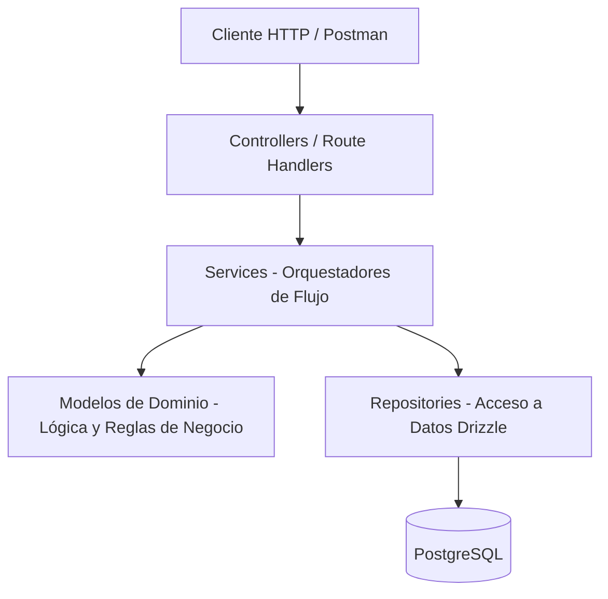

# Architectural & Technology Research: Entrega 1 - Core CI/CD, Modelo Mínimo, Autenticación y Catálogo

**Feature**: [spec.md](./spec.md)  
**Date**: 2026-09-12  
**Status**: Completed  

---

## 1. Resumen Ejecutivo y Stack Tecnológico

Siguiendo las pautas del trabajo práctico (`docs/project-context.md`), la especificación (`spec.md`) y el enfoque arquitectónico acordado:

| Dimensión | Tecnología / Librería | Justificación |
| :--- | :--- | :--- |
| **Framework & Runtime** | Next.js 16 (App Router) + Node.js 20+ | Runtime estándar para backend y frontend unificados; Route Handlers para endpoints REST. |
| **Lenguaje** | TypeScript 5 (Strict Mode) | Tipado estático de punta a punta (modelos, servicios, controladores). |
| **Patrón Arquitectónico** | **Controller $\to$ Service $\to$ Repository con Modelo de Dominio Rico** | Separación limpia de responsabilidades: el **Modelo** contiene la lógica y las invariantes de negocio; el **Service** orquesta los flujos; el **Repository** maneja el acceso a datos; el **Controller** atiende HTTP. |
| **ORM & Base de Datos** | Drizzle ORM (`drizzle-orm` + `drizzle-kit` + `postgres`) | Definición de esquemas en TypeScript, tipado estricto y migraciones automatizadas. |
| **Testing** | Vitest (`vitest` + `@vitest/coverage-v8`) | Runner de tests ultra rápido en TypeScript/ESM con cobertura de código nativa. |
| **Seguridad** | `jsonwebtoken` / `jose` + `bcryptjs` | Hasheo de contraseñas con bcrypt y generación de tokens JWT estándar (vigencia 24h). |
| **Validación** | `zod` | Validación y sanitización de schemas de entrada en controladores HTTP. |
| **Documentación API** | OpenAPI 3.0 / Swagger (`swagger-ui-dist`) | Documentación interactiva en `/api/docs` con esquema `BearerAuth`. |
| **CI/CD & Calidad** | GitHub Actions (`.github/workflows/ci.yml`) + SonarCloud | Pipeline automático en cada Push/PR (lint, build, tests con cobertura y SonarCloud <10 issues). |

---

## 2. Separación de Responsabilidades: Dominio vs Orquestación

### 1. Modelo de Dominio Rico (`src/models/`):
- **Contiene la lógica de negocio pura y las invariantes del sistema:**
  - `Player`: Valida estrictamente que la liga pertenezca a las 5 ligas europeas oficiales (`PREMIER_LEAGUE`, `BUNDESLIGA`, `LA_LIGA`, `SERIE_A`, `LIGUE_1`). Si no es válida, lanza una excepción de dominio.
  - `User`: Valida formato de email, asigna automáticamente los **1.000 créditos de bienvenida** al rol `INVESTOR`, y gestiona el estado de la cuenta.
  - `TokenHolding`: Modela la tenencia y mantiene la invariante de emisión de **100 tokens fijos** a cotización base de **1 crédito** en $t_0$.

### 2. Servicios Orquestadores (`src/services/`):
- **No contienen las reglas del dominio; orquestan y coordinan las operaciones:**
  - `AuthService`: Orquesta la verificación de unicidad de email con el repositorio, la instanciación de la entidad `User`, la coordinación del hasheo de contraseñas, la persistencia en base de datos y la emisión del token JWT de 24 horas.
  - `PlayerService`: Orquesta la consulta al repositorio aplicando filtros y paginación, y mapea las entidades resultantes a DTOs para el controlador.

### 3. Repositorios (`src/repositories/`):
- Encapsulan las operaciones CRUD y consultas sobre PostgreSQL usando Drizzle ORM (`UserRepository`, `PlayerRepository`).

### 4. Controladores (`src/controllers/`):
- Reciben requests HTTP de Next.js Route Handlers, validan el payload con Zod, delegan la acción al Service orquestador y formatean la respuesta HTTP (códigos 200, 201, 400, 401, 404, 409).

---

## 3. Seguridad y Autenticación

- **Token:** JWT firmado con `JWT_SECRET`, algoritmo `HS256`, vigencia **24 horas**.
- **Middleware / Guard (`auth.middleware.ts`):** Extrae el header `Authorization: Bearer <token>`, valida el JWT y rechaza con `401 Unauthorized` si no es válido o expiró.
- **Rutas Públicas:** `POST /api/auth/register`, `POST /api/auth/login`, `GET /api/health`, `GET /api/docs`.
- **Rutas Protegidas:** `GET /api/players`, `GET /api/players/:id`.

---

## 4. Dataset Inicial de Seeding (15 Jugadores en 5 Ligas)

- **Premier League**: Erling Haaland (Man City - Delantero), Kevin De Bruyne (Man City - Mediocampista), Declan Rice (Arsenal - Mediocampista).
- **La Liga**: Kylian Mbappé (Real Madrid - Delantero), Vinícius Jr (Real Madrid - Delantero), Pedri (Barcelona - Mediocampista).
- **Bundesliga**: Harry Kane (Bayern Munich - Delantero), Jamal Musiala (Bayern Munich - Mediocampista), Florian Wirtz (Bayer Leverkusen - Mediocampista).
- **Serie A**: Lautaro Martínez (Inter - Delantero), Nicolò Barella (Inter - Mediocampista), Rafael Leão (AC Milan - Delantero).
- **Ligue 1**: Bradley Barcola (PSG - Delantero), Ousmane Dembélé (PSG - Delantero), Ludovic Ajorque (Brest - Delantero).
